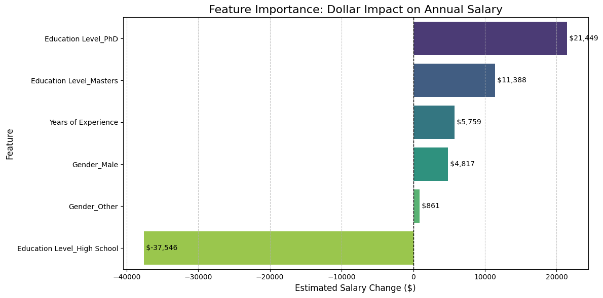

# Salary-Prediction-Project
Bivariate, Multivariate, and Regression analysis on salary data

# Salary Prediction

## Project Overview
This project analyzes employee data to predict salaries based on **Years of Experience**, **Education Level**, and **Gender**. By moving from a simple Bivariate Regression to a Multivariate model, we successfully quantified the specific dollar value of higher education degrees.

## Key Findings
* **Experience Impact:** For every year of work, salary increases by approximately **$5,759**.
* **The PhD Premium:** Holding a PhD adds **$21,449** to an annual salary compared to a Bachelor's degree.
* **The Master's Boost:** A Master's degree adds **$11,388** over a Bachelor's.
* **High School Penalty:** Stopping education at High School results in a **$37,546** salary deficit compared to a Bachelor's.
* **Model Accuracy:** The final model achieved an **R² score of 0.71**.

## Feature Importance
The following chart visualizes the estimated dollar impact of each feature on annual salary:

## How to Run
1. Clone the repository.
2. Install dependencies: `pip install -r Requirements.txt`
3. Open `Salary_prediction_LinearRegression.ipynb` in Jupyter or Google Colab.
